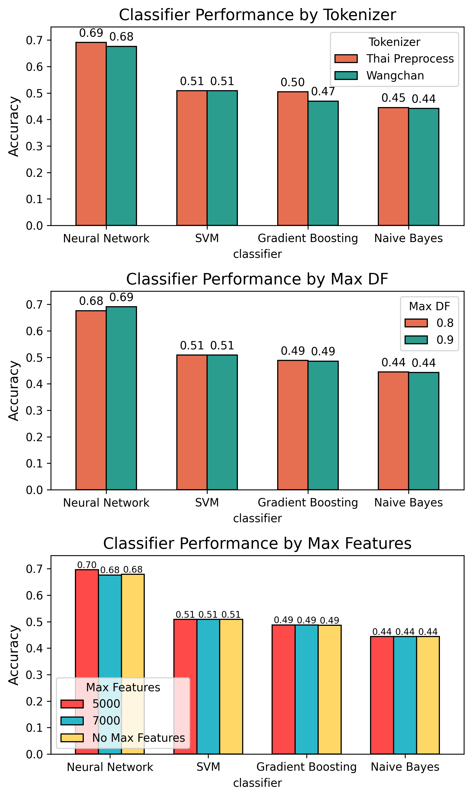
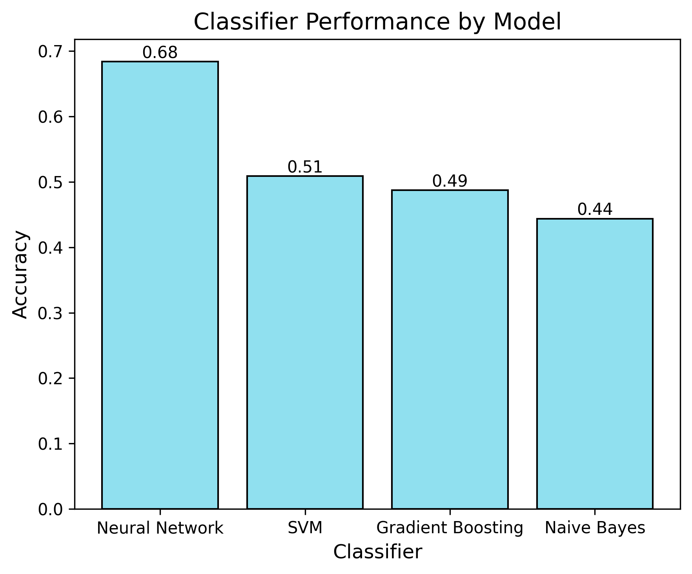

##  Capstone Project: Classification of Thai Logistics Research Papers

## Introduction

In the field of logistics, research studies are growing rapidly in Thailand, covering various aspects such as supply chain management, transportation, and logistics systems. However, many of these research papers are scattered and lack organization based on their key themes and concepts. This makes it challenging for students, researchers, and industry professionals to easily access relevant information and trends within specific logistics topics.

This project aims to classify Thai logistics research papers based on the entire text within the article, categorizing them into predefined groups related to key logistics themes. By applying natural language processing (NLP) and classification techniques, the goal is to identify major topics within the research and make it easier to find relevant studies. This will help researchers and industry professionals quickly navigate the growing body of Thai logistics research and provide insights into areas that require further exploration.

## Class Descriptions
The classification of logistics research papers is based on eight key categories that represent various aspects of the logistics and supply chain industry. Each class focuses on a distinct area of study, providing insights into the specific themes and research trends within that field. Here are the classes and what they represent:

1. **Demand Planning**: Research in this class focuses on predicting customer demand, forecasting techniques, and planning for future logistics and supply chain needs to ensure efficient operations.

2. **Procurement and Sourcing**: This class includes research related to the sourcing and acquisition of goods and services, focusing on strategies, supplier relationships, procurement processes, and cost management.

3. **Manufacturing and Production**: Research papers in this category explore production planning, manufacturing processes, automation, lean practices, and production efficiency in the logistics and supply chain sector.

4. **Warehouse and Inventory Management**: This class covers topics related to managing inventory, including stock control, inventory systems, demand-supply balance, and optimizing storage and movement of goods.

5. **Distribution and Transportation**: This category includes research on the transportation, warehousing, and delivery of goods. It addresses topics like distribution network design, last-mile delivery, and logistics optimization strategies.

6. **Import-Export**: This class covers research on cross-border trade, customs procedures, international shipping, and the regulatory environment surrounding import and export logistics.

7. **After Sales Services**: Research papers in this category address the logistics aspects of customer service, including order fulfillment, returns management, service level agreements (SLAs), and customer satisfaction in logistics operations.

8. **Others**: This category includes research that does not fit into the aforementioned classes. It encompasses niche topics or emerging trends in logistics that don't fall under traditional categories.

## Exploratory Data Analysis
1. **Distribution of Classes**

    The logistics research papers are classified into eight categories. Below is the distribution of the number of research papers across each class:
    
    This distribution indicates that the majority of research papers are focused on **Warehouse and Inventory Management** and **Distribution and Transportation**, while **After Sales Services** has the least representation. These counts will help guide the understanding of trends and gaps in the research within the logistics field.

2. **Feature Importance**

    We analyze the importance of different features for each class. By examining how specific features (such as keywords, topics, or phrases) influence the classification of papers into their respective categories, we can gain insights into what distinguishes each class from the others. The following chart visualizes the most important words for each of the eight classes in the dataset, illustrating how certain terms are more relevant to specific categories.
Below is a visualization of the most important words for each class. These words have been identified based on their contribution to distinguishing each class from others. The chart below shows the top word features that are most relevant to each of the 8 classes:

## Vectorizer & Tokenizer Performance
In this step, we aim to evaluate how different tokenization techniques and vectorization methods impact the performance of the machine learning models. We use two tokenization approaches:

1. **Newmm Tokenizer (from `pythainlp`)**: This tokenizer uses the newmm engine, which is a popular method for segmenting Thai text into words. This helps in handling Thai text more effectively by splitting the sentence into meaningful components.

2. **Tokenizer from WangchanBERTa**: This tokenizer is specifically built for Thai language models, and it processes the text by dividing it into sub-word tokens, which might provide better handling of rare or compound words.

We then compare how these tokenizers perform when paired with the **TF-IDF vectorizer**, which converts the text into a matrix of features where the importance of each word is determined by its frequency and inverse document frequency. The vectorizer is tuned with different parameters:

`max_df`: The maximum document frequency, which limits how frequently a word can appear in the dataset to be considered useful.
Values considered: `0.8`, `0.9`
`max_features`: The maximum number of features (words) to consider.
Values considered: `5000`, `7000`, `None` (no limit)
The goal is to reduce the number of features (average of 13,000 features) to a more manageable size and clean the data, improving the models' performance.

## Model Evaluation
To evaluate the performance, we compared the accuracy scores (and other relevant metrics) of four different machine learning models: Naive Bayes, Support Vector Machine (SVM), Gradient Boosting, and Neural Network. We also tested different tokenization techniques and vectorizer parameters to identify the optimal combination.

**Accuracy/Score vs. Tokenizer & Vectorizer Parameters**

**Accuracy/Score vs. Model**

**Key Findings:**
- **Best Tokenizer**    : The **Newmm tokenizer** (from `pythainlp`) performed better than the WangchanBERTa tokenizer for this classification task.

- **Best Vectorizer Settings**: The optimal vectorizer configuration was `max_features = 5000` and `max_df = 0.9`. This setup significantly improved model performance by reducing feature noise and ensuring that only the most important words were retained.

- **Best Model**: The **Neural Network** outperformed the other models (Naive Bayes, SVM, and Gradient Boosting), achieving the highest accuracy.

**Best Configuration:**
- **Tokenizer**: Newmm Tokenizer
- **Vectorizer**: `max_features = 5000`, `max_df = 0.9`
- **Model**: Neural Network (5 hidden layers, early stopping, dropout 0.2)
**Best Accuracy**: The best-performing model, using the above configuration, achieved an accuracy of **0.71**.

## Model Performance Summary

### Classification Report:
|               Category                | Precision | Recall | F1-Score | Support |
|---------------------------------------|-----------|--------|----------|---------|
|           After Sales Service         |    0.5    |  0.2   |   0.29   |    5    |
|            Demand Planning            |   0.56    |  0.71  |   0.62   |    7    |
|             Import-Export             |   0.79    |  0.92  |   0.85   |   12    |
|Warehouse and Inventory Management|   0.76    |  0.84  |   0.8    |   31    |
|        Distribution and Transportation       |   0.68    |  0.71  |   0.7    |   21    |
|       Manufacturing and Production        |   0.67    |  0.44  |   0.53   |    9    |
|                Others                 |    0.5    |  0.38  |   0.43   |    8    |
|              Procurement and Sourcing             |   0.89    |  0.89  |   0.89   |    9    |

**Summary of Insights:**

- **Best Performance**: The model is most effective at predicting research papers related to **Procurement**, **Import-Export** and **International Trade**, and **Inventory Management**.
- **Challenges**: It struggles with **Customer Service**, **Manufacturing/Production**, and **Others**, where the performance metrics are lower, potentially due to the imbalanced distribution of categories or insufficient samples for training in these areas.

## Conclusion 
The project has successfully classified Thai logistics research papers into eight categories with an accuracy of **71.57%**. While categories like **Procurement** and **Import-Export** performed well, others such as **Customer Service** and **Manufacturing/Production** need improvement.

## Next Steps:
1. **GUI for Recommender System:**

- Develop a user-friendly GUI to allow easy interaction with the model and provide research paper recommendations based on categories.

2. **Multi-Category Classification:**

- Modify the model to support **multi-category classification**, enabling papers to belong to multiple categories.

3. **Summarization and Keyword Extraction:**

- Implement automatic **summarization** and **keyword extraction** to highlight key concepts from research papers for efficient browsing and analysis.

4. **End-to-End Literature Review Pipeline:**

- Create an end-to-end process to **automate categorization**, summarization, and keyword extraction for literature review tasks.

These improvements will enhance the system's usability and make it more valuable for logistics researchers and professionals.

